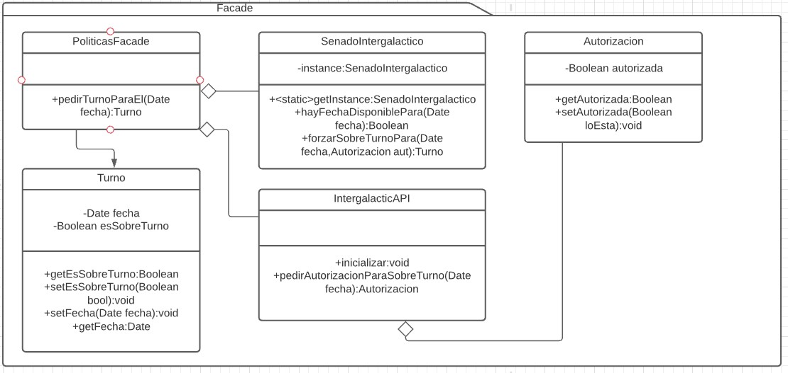

# Facade
Es un patron estructural. [Link descripcion](https://sourcemaking.com/design_patterns/facade)

Simplifica el acceso a un complejo sistema de interacción entre objetos.

## Diagrama de clases

## SOLID

* Single responsibility

Un facade no tiene razón para tener más responsabilidades que la de simplificar una sola operación lógica entre una más compleja estructura de objetos. Si tiene más de una responsabilidad debería poder separarse entre más objetos facade para que cada uno tenga solo una responsabilidad bien definida. A su vez la única razón de cambio que debería tener es al cambiar la lógica de la operación que se esta "enmascarando" tras el facade

* Open/Close principle

Es perfectamente implementable que un facade quede como supertipo y una serie de "hijos" del facade sean responsables de implementar la nueva logica del mismo, por lo que este principio se cumple

* Liskov substitution

Un facade hijo debería ser perfectamente intercambiable con cualquier facade en la cadena de herencia. Este principio debería cumplirse

* Interface segregation

Como se menciona en el punto **single responsibility** si un facade empieza a transformarse en un superobjeto lleno de responsabilidades debería perfectamente poder separarse en pequeñas clases que implementen cada uno la logica relacionada con su objetivo por lo que este principio debería cumplirse.

* Dependency inversion

Mediante el uso de abstract factories y otras estrategias de instanciacion de objetos un facade podría estar perfectamente desacoplado de sus dependencias